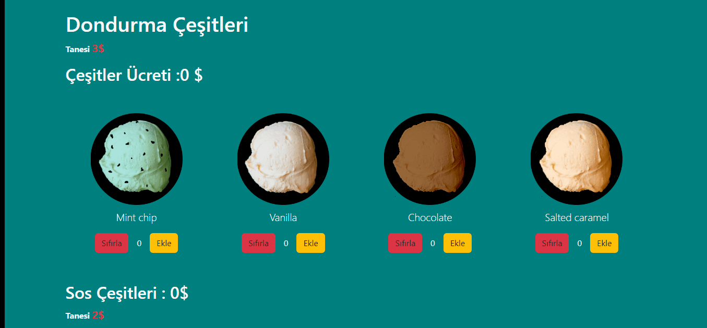

# Unit Test - Icecream

## Used libraries

-
- axios^0.27
- Json-Server
- @testing-library/user-event@14.0

### created 3 different test pages.

- Form.test
- Scoops.test
- Toppins.test
-- used fireEvent , userEvent for component trigger events(click,keyboard..)
-- async await form

